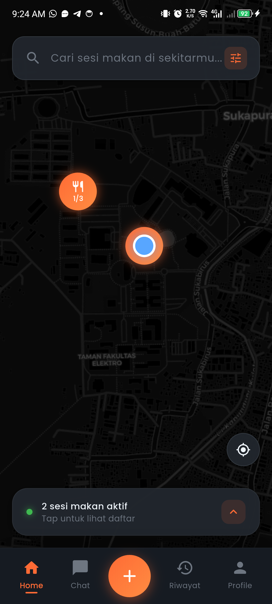
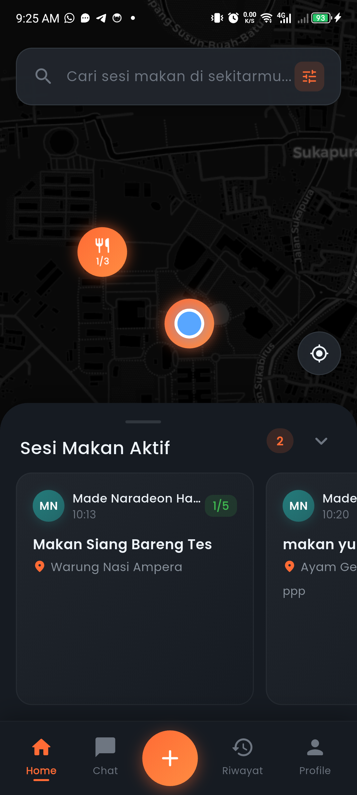
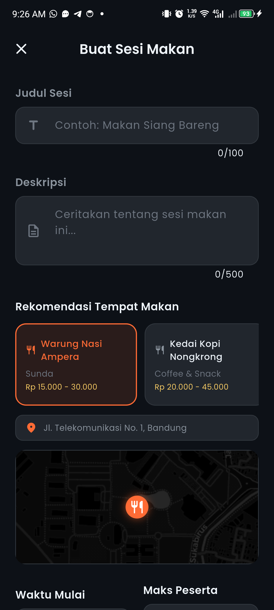
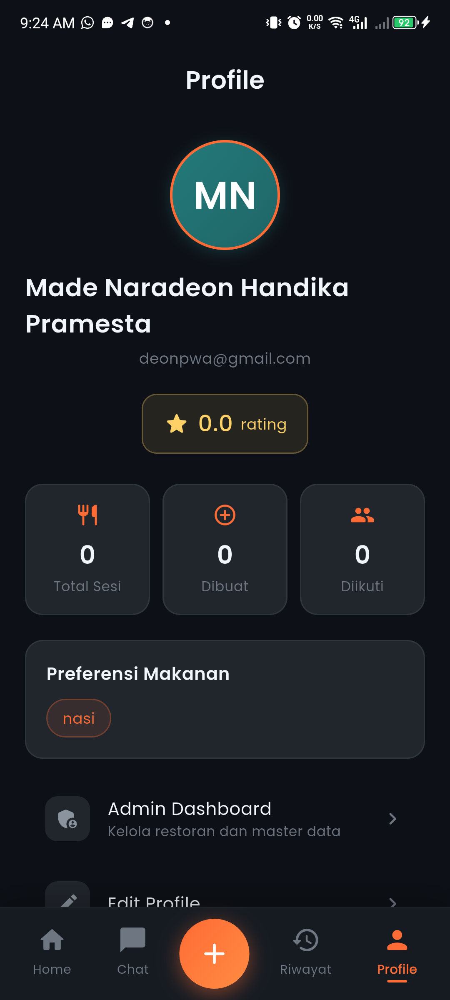

# MakanBareng

**MakanBareng** adalah aplikasi mobile Android yang membantu mahasiswa mencari teman makan secara spontan di sekitar kampus. Pengguna dapat membuat sesi makan dengan lokasi dan waktu tertentu, melihat sesi yang dibuat orang lain di peta, bergabung, mengobrol dalam grup sesi secara realtime, lalu saling memberi rating setelah sesi selesai.

Aplikasi ini dikembangkan sebagai tugas besar mata kuliah **Aplikasi Perangkat Bergerak (CBK3GAB3)** di Telkom University.

---

## Tentang Aplikasi

Sering kali kita ingin makan bersama orang lain tapi tidak tahu siapa yang sedang lapar di waktu dan tempat yang sama. MakanBareng menjawab persoalan itu: siapa pun bisa membuka "sesi makan" sebagai ajakan terbuka, dan mahasiswa lain di sekitarnya dapat melihat ajakan tersebut langsung di peta lalu ikut bergabung.

Fokus aplikasi ada pada tiga hal:

- **Spontan** — sesi dibuat untuk waktu dekat, bukan acara terjadwal jauh hari.
- **Berbasis lokasi** — semua sesi tampil di peta sehingga pengguna tahu mana yang dekat.
- **Sosial** — ada chat per sesi dan sistem reputasi (rating) antar pengguna.

---

## Fitur Utama

### Aplikasi Pengguna (Diner)

- **Autentikasi** — registrasi dan login menggunakan Email/Password atau Google Sign-In.
- **Beranda + Peta** — daftar sesi makan aktif dan peta interaktif (OpenStreetMap) dengan marker untuk setiap sesi beserta kapasitasnya.
- **Buat Sesi Makan** — tentukan judul, deskripsi, lokasi/tempat makan, waktu mulai, dan jumlah kursi maksimum.
- **Cari & Filter** — cari sesi berdasarkan judul, serta filter berdasarkan jarak dan waktu.
- **Detail Sesi & Gabung** — lihat detail sesi dan bergabung; sesi otomatis terkunci ketika kapasitas penuh.
- **Chat Realtime** — obrolan grup per sesi yang tersinkron secara realtime.
- **Riwayat Sesi** — daftar sesi yang pernah dibuat maupun diikuti.
- **Rating & Ulasan** — beri penilaian antar peserta setelah sesi selesai untuk membangun reputasi.
- **Profil** — kelola nama, foto, bio, dan preferensi makanan.
- **Notifikasi** — pemberitahuan lokal saat ada aktivitas pada sesi (mis. peserta baru bergabung).

### Dashboard Admin

- Login admin terpisah (akun dengan flag `isAdmin`).
- Kelola pengguna (lihat, suspend, hapus).
- Kelola sesi (lihat dan tutup paksa sesi).
- Kelola data tempat makan (CRUD).

---

## Tampilan Aplikasi

| Beranda & Peta | Daftar Sesi Aktif | Buat Sesi Makan | Profil |
|:---:|:---:|:---:|:---:|
|  |  |  |  |

---

## Teknologi

| Lapisan | Teknologi |
|---------|-----------|
| Framework | Flutter (Dart) |
| State management | Provider |
| Backend | Firebase Authentication, Cloud Firestore |
| Peta | `flutter_map` + OpenStreetMap (tema CartoDB Dark), `latlong2` |
| Lokasi | `geolocator` |
| Notifikasi | `flutter_local_notifications` (lokal, dipicu listener Firestore) |
| UI/UX | `google_fonts`, `flutter_rating_bar`, `shimmer` |
| Foto profil | Foto akun Google atau avatar otomatis dari `ui-avatars.com` |

Peta menggunakan OpenStreetMap melalui package `flutter_map` sebagai alternatif open-source dari Google Maps (gratis, tanpa API key). Foto disimpan sebagai URL eksternal sehingga tidak memerlukan Firebase Storage, dan aplikasi dapat berjalan penuh pada Firebase Spark plan (gratis).

---

## Menjalankan Proyek

Prasyarat: Flutter SDK (Dart `^3.11.4`) dan sebuah device/emulator Android.

```bash
# 1. Pasang dependensi
flutter pub get

# 2. Jalankan di device yang terhubung
flutter run
```

Konfigurasi Firebase (`google-services.json` / `firebase_options.dart`) sudah disertakan untuk proyek Firebase pengembangan.

### Pengujian

Suite unit test tersedia untuk model, logika bisnis, dan widget:

```bash
flutter test
```

---

## Tim Pengembang

| Nama | NIM | Tanggung Jawab |
|------|-----|----------------|
| Made Naradeon HP (Deon) | 103032300101 | Backend Lead — beranda, peta, search & filter, koordinasi data model & dokumentasi |
| Revandi Akbar | 103032300120 | Rating, review, testing |
| Naemu Enggar M | 103032330009 | Sesi, chat, riwayat, notifikasi |
| Muhammad Ihsan P | 103032330023 | Profil, admin dashboard, UI/UX |
| Saladin Setyo H | 103032330194 | Firebase setup, Auth, struktur Firestore |

---

> Dokumen teknis lengkap (struktur data, arsitektur, konvensi) ada di [`MAKAN_BARENG_SPEC.md`](MAKAN_BARENG_SPEC.md). Panduan kerja tim ada di [`TEAM_GUIDE.md`](TEAM_GUIDE.md).
</content>
</invoke>
