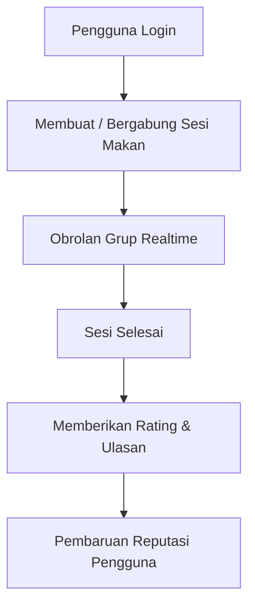
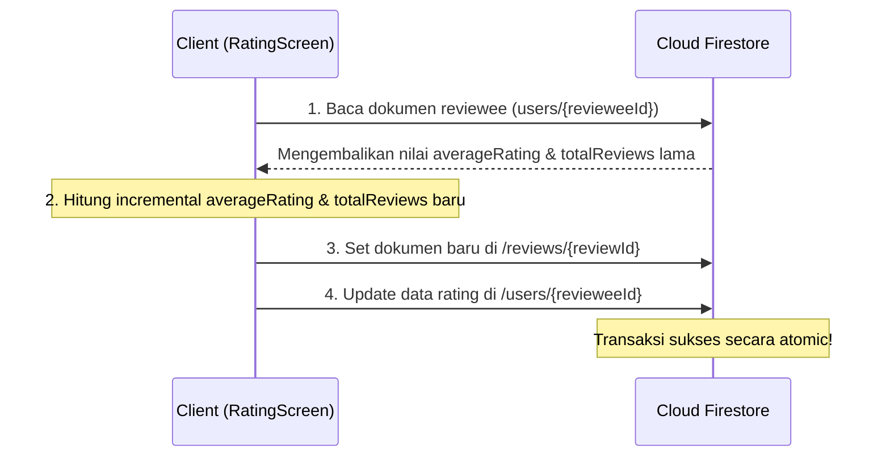

# MakanBareng — Dokumentasi Sistem & Alur Kerja

Aplikasi mobile berbasis Android yang dikembangkan menggunakan Flutter untuk memudahkan mahasiswa mencari teman makan secara spontan di sekitar kampus Telkom University.

---

## 1. Alur Sistem (System Flow)

Sistem MakanBareng bekerja secara terintegrasi dengan backend Firebase (Auth & Firestore) melalui alur data berikut:



### 1.1 Alur Autentikasi (Auth Flow)
- Pengguna mendaftar/masuk menggunakan **Email & Password** atau **Google Sign-In**.
- Jika pengguna baru berhasil mendaftar, dokumen baru otomatis terbuat pada Firestore di path `users/{userId}` dengan nilai default awal.

### 1.2 Alur Sesi Makan (Session Flow)
- Pembuat sesi (Host) memilih lokasi makan melalui OpenStreetMap, mengisi judul, waktu, deskripsi, dan kapasitas kursi.
- Peserta lain dapat melihat daftar sesi aktif di beranda atau peta, kemudian bergabung. Status sesi akan otomatis terkunci (`full`) ketika batas kapasitas tercapai.

### 1.3 Alur Obrolan Realtime (Chat Flow)
- Setelah bergabung ke sesi, peserta dapat saling mengobrol menggunakan chat room yang sinkron secara realtime menggunakan Firestore Listener (`snapshots()`).

---

## 2. Modul Rating & Review (Tugas Revandi)

Modul ini bertanggung jawab mengelola penilaian reputasi antar-pengguna setelah sesi makan bersama dinyatakan selesai.

### 2.1 Alur Transaksi Firestore (Firestore Transaction)
Untuk menjamin akurasi reputasi rating pengguna secara realtime tanpa terjadi balapan data (*race condition*), proses penyimpanan ulasan dilakukan menggunakan **Firestore Transaction** sebagai berikut:



Rumus perhitungan rating bertahap (*incremental average*):
$$\text{newAvg} = \frac{(\text{currentAvg} \times \text{currentTotal}) + \text{newRating}}{\text{currentTotal} + 1}$$

### 2.2 Struktur Data Ulasan (Firestore Schema)

Berkas ulasan disimpan pada root koleksi `/reviews` dengan struktur:
- `reviewId` (String, document ID)
- `sessionId` (String)
- `sessionTitle` (String, denormalized)
- `reviewerId` (String)
- `reviewerName` (String, denormalized)
- `reviewerPhotoUrl` (String, denormalized)
- `revieweeId` (String)
- `revieweeName` (String, denormalized)
- `rating` (Double, 1.0 - 5.0)
- `comment` (String)
- `createdAt` (Timestamp, server-generated)

---

## 3. Instruksi Pengujian (Testing Guide)

Proyek ini telah dilengkapi dengan suite pengujian unit yang komprehensif untuk memvalidasi model, logika bisnis, dan widget.

### 3.1 Menjalankan Pengujian
Jalankan perintah berikut pada direktori root proyek untuk mengeksekusi semua tes:
```powershell
flutter test
```

### 3.2 Struktur Berkas Pengujian
- `test/models/review_model_test.dart`: Validasi parsing JSON/Firestore, immutability, dan pembentukan objek `ReviewModel`.
- `test/services/review_service_logic_test.dart`: Validasi kalkulasi reputasi rating, validasi batas atas/bawah rating (1.0 - 5.0), dan pencegahan rating ganda (*double rating prevention*).
- `test/services/auth_service_logic_test.dart`: Validasi penanganan kode kesalahan Firebase Auth dan pembentukan URL avatar default.
- `test/services/session_service_logic_test.dart`: Validasi penentuan perubahan status otomatis sesi (`open`, `full`) dan kapasitas limit kursi.
- `test/widget_test.dart`: Pengujian widget mandiri untuk komponen reusable `CustomButton` dan `AvatarWidget` tanpa dependensi Firebase.
